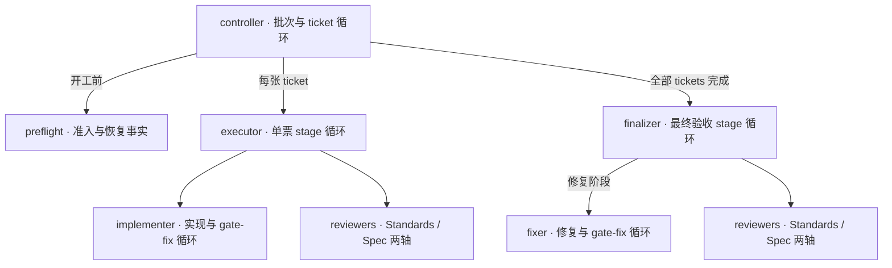

# Beadwork 架构

本文用于快速理解角色分工。执行细节以 [beadwork-run](../skills/beadwork-run/SKILL.md) 及其引用的协议为准；目标项目的接入方式见 [project-contract.md](project-contract.md)。

## 总体关系

一个 parent 对应一个批次：**准入检查 → 串行完成 tickets → 最终验证与修复 → 合入本地 main → 关闭 parent → 清理**。交付保留在本地，不执行 Git 或 Beads push。

下图箭头表示直接派发关系；子角色向派发者交付结果。controller 是顶层协调者，由 skill 主流程承担。

implementer/fixer 完成并停止写入后，才开始对应 review；两轴 reviewer 可并行，源码 writer 同一时刻只有一个。

## 角色职责

| 角色与规则入口 | 负责什么 | 交付给谁 |
| --- | --- | --- |
| [controller](../skills/beadwork-run/SKILL.md) | 选择、领取、关闭 tickets；环境准备、Git/worktree 生命周期、整票与最终交付验收、本地集成与收尾；独占 Beads 写入 | 用户 |
| [preflight](../skills/beadwork-run/agents/preflight.md) | 固定 children 范围，核对工具链、recipes、spec/Test plan 和恢复事实；只写证据 | controller：`READY` / `BLOCKED` |
| [executor](../skills/beadwork-run/agents/ticket-executor.md) | 协调整张 ticket；管理 stages、计划适配、实现语义验收与双轴 review；只写证据 | controller：`DONE` / `NEEDS_CONTEXT` / `BLOCKED` |
| [implementer](../skills/beadwork-run/agents/implementer.md) | 当前 stage 的源码实现、测试、分层提交和交付 gates；自行处理阶段内 gate-fix | executor：实现结果与验证证据 |
| [reviewer](../skills/beadwork-run/agents/reviewer.md) | 按 Standards 或 Spec 轴独立只读审查；提供原始 findings | executor 或 finalizer：本轴报告 |
| [finalizer](../skills/beadwork-run/agents/finalizer.md) | 汇总批次边界；管理最终 stages、修复语义验收与双轴 review；stage 0 自行跑最终 gates | controller：`READY_TO_MERGE` / `BLOCKED` |
| [fixer](../skills/beadwork-run/agents/fixer.md) | 最终修复 stage 的唯一源码 writer；修复批次阻塞、提交并完成最终 gates，自行处理 gate-fix | finalizer：修复结果与验证证据 |

`READY` 不代表已安装、冒烟或领取；implementer/fixer 的 `DONE` 不代表 review 通过；reviewer 的 `COMPLETED` 只表示审查完成，是否通过由 findings 决定。最终合入由 controller 执行。

## 三层循环

| 层次 | 谁管理 | 推进规则 |
| --- | --- | --- |
| ticket | controller | 当前票验收完成后，核对固定执行序列及实时依赖，只选择下一张未完成票；每票使用全新 executor |
| stage | executor / finalizer | 代码失败进入下一阶段；每阶段至多一轮完整双轴 review。ticket 从 stage 0 实现；最终验收 stage 0 无 writer，stage 1..5 才派 fixer |
| gate-fix | implementer / fixer | 当前 writer 在同一 stage 内修正交付 gate 的代码失败；用尽机会仍失败才交回上层 |

阶段与 gate-fix 的额度由脚本绑定；session 接替不等于新阶段。中断接续原阶段，环境/spec/seam 等非代码阻塞保留证据并停止。具体次数与恢复输入见角色协议。

## 验收与实现边界

- **agent 判断语义，脚本校验事实。** executor/finalizer 负责需求、修复处置、验证覆盖和 review 的日常语义验收；controller 核对交付与集成条件，遇到矛盾、缺证或越界迹象再追查。
- **验证由当前执行者负责。** controller 在初始化和改变 HEAD 的票间同步建立 `gate-core` 快速基线；ticket 的定向行为证据、非 deferred 完整 gates 与必要的提前边界由 implementer 执行；最终 stage 0 由 finalizer 执行一次完整 `gate-full`，修复阶段由 fixer 重新执行该入口。相同 HEAD 的完整有效结果复用。
- **报告可追溯。** 使用文件报告、短回执及 SHA-256 来源绑定；直接派发者验收子角色。报告与更正 append-only，最终阶段检查点固定 fixer/review/阶段报告选择；验证绑定原始运行，补充 gates 累计继承。派发者记录收尾观察，回执不替代任务停止确认。详见 [交付协议](../skills/beadwork-run/references/report-delivery.md)。
- **源码与协议各有入口。** `skills/` 是 skill 源码；[scripts/](../skills/beadwork-run/scripts/) 实现身份、计数、状态和证据校验，不派发 agent；[共享测试契约](../skills/beadwork-run/references/testing-contract.md) 定义测试规则，目标项目的 `justfile` 定义实际验证命令。本文不复制这些协议。

## 脚本入口与内部依赖

公开 CLI 保持稳定，内部按事实、状态、报告和操作分组。下表用于源码维护；命令参数仍以 skill 引用的执行协议为准。

| 分组 | 入口与实现 | 职责 |
| --- | --- | --- |
| 公开入口 | [beadwork.py](../skills/beadwork-run/scripts/beadwork.py) → [cli.py](../skills/beadwork-run/scripts/cli.py) | 唯一公开 Python CLI、Python 下限检查、argparse 路由、JSON 与退出码边界 |
| 顶层操作 | [controller.py](../skills/beadwork-run/scripts/controller.py)、[executor_operations.py](../skills/beadwork-run/scripts/executor_operations.py) | 批次验收与集成；多角色操作、现场检查 |
| 操作编排 | [ticket_execution.py](../skills/beadwork-run/scripts/ticket_execution.py)、[finalization.py](../skills/beadwork-run/scripts/finalization.py)、[review_operations.py](../skills/beadwork-run/scripts/review_operations.py) | 阶段准备、验收后选择、review 准备与收集、最终交付 |
| 状态 | [ticket_state.py](../skills/beadwork-run/scripts/ticket_state.py)、[final_state.py](../skills/beadwork-run/scripts/final_state.py)、[gate_repair.py](../skills/beadwork-run/scripts/gate_repair.py) | 检查点、当前 writer、来源选择、冻结和额度 |
| 报告与只读来源 | [ticket_reports.py](../skills/beadwork-run/scripts/ticket_reports.py)、[implementer_reports.py](../skills/beadwork-run/scripts/implementer_reports.py)、[fixer_reports.py](../skills/beadwork-run/scripts/fixer_reports.py)、[review_evidence.py](../skills/beadwork-run/scripts/review_evidence.py) | 组装候选报告并校验字段、Git 事实和原始来源；不推进阶段 |
| 验证 | [run_verification.py](../skills/beadwork-run/scripts/run_verification.py)、[ticket_verification.py](../skills/beadwork-run/scripts/ticket_verification.py)、[final_verification.py](../skills/beadwork-run/scripts/final_verification.py)、[report_io.py](../skills/beadwork-run/scripts/report_io.py) | 运行采集与报告读取分开；ticket/final 各自判断覆盖；内部 verifier facade 直接调用各报告校验实现 |
| 基础契约 | [evidence.py](../skills/beadwork-run/scripts/evidence.py)、[repository.py](../skills/beadwork-run/scripts/repository.py)、[dispatch_contract.py](../skills/beadwork-run/scripts/dispatch_contract.py) | 文件绑定、仓库事实、dispatch 身份与计划；不依赖阶段编排或报告校验实现 |
| 其他操作 | [preflight_operations.py](../skills/beadwork-run/scripts/preflight_operations.py)、[plan_operations.py](../skills/beadwork-run/scripts/plan_operations.py)、[graph.py](../skills/beadwork-run/scripts/graph.py)、[tracker_operations.py](../skills/beadwork-run/scripts/tracker_operations.py)、[batch_initialize.py](../skills/beadwork-run/scripts/batch_initialize.py)、[batch_evidence.py](../skills/beadwork-run/scripts/batch_evidence.py) | 准入、串行计划、依赖图、tracker intent、批次初始化和批次证据 |

外部报告校验统一使用 `beadwork.py verify ticket|phase|worker`，实现分别位于 [verify_ticket.py](../skills/beadwork-run/scripts/verify_ticket.py)、[phase_validation.py](../skills/beadwork-run/scripts/phase_validation.py) 和 [worker_validation.py](../skills/beadwork-run/scripts/worker_validation.py)。工作流内部通过 Python API 直接调用校验实现，避免为 schema 或报告检查重复启动解释器。`self_check_argv` 由 [command_argv.py](../skills/beadwork-run/scripts/command_argv.py) 统一构造，不经过 shell。仓库级 [maintenance_check.py](../scripts/maintenance_check.py) 只负责结构、链接和 Python 语法检查；完整门禁由根目录 justfile 编排。

`handoff.py` 维护 context/closure 证据；schema、模型政策、进程组和运行记录分别由既有基础模块维护。基础模块与报告读取不反向导入 controller/executor 入口；状态模块不调用阶段编排；verifier facade 不使用动态 import 掩盖依赖方向。`test_module_boundaries.py` 检查静态及字面量动态 import 回路、依赖方向、schema 冷启动和安装 symlink 入口。

验证来源由 `verification_records.py` 统一发现和读取；ticket 的固定快照逐条解析一次，同时供报告摘要和 gate 覆盖判断使用。缺失 started 也有明确的目录身份，只能形成部分阻塞交付。新报告检查当前来源完整性，历史报告不重新扫描新增运行。具体快照契约见[验证采集](../skills/beadwork-run/references/verification.md)。

单次 stage 验收显式传递已核验的 checkpoint 状态，并按 reviewer dispatch/report/receipt 的内容复用成功校验；跨命令不保留缓存，closure 和当前调用方身份仍逐次检查。checkpoint 直接保存累计 gate 状态，读取时不再从旧报告补字段。fixer 的固定验证来源由 worker verifier 检查一次，调用方继续检查当前来源完整性、Git 现场与收尾证据。

源码拆分的范围与验证结果见[实施方案](plans/script-modularization-plan.md)及[验收记录](acceptance/script-modularization-acceptance.md)。正常流程的历史精简见[改造计划](plans/normal-flow-simplification-plan.md)。当前初始化由 `beadwork.py batch-initialize` 调用 `batch_initialize.py` 完整执行；清理直接校验本地 merge checkpoint 与现场；角色只填写生成的 draft 输入契约。

串行顺序由 parent 的 `ticket_order` 区块声明；`execution_plan.py` 负责解析、依赖与状态校验、批次计划来源链，`beadwork.py plan` 提供发布和显式接纳入口。`expected_children` 仍表示成员集合。详见[串行规划契约](../skills/beadwork-run/references/serial-planning.md)。
