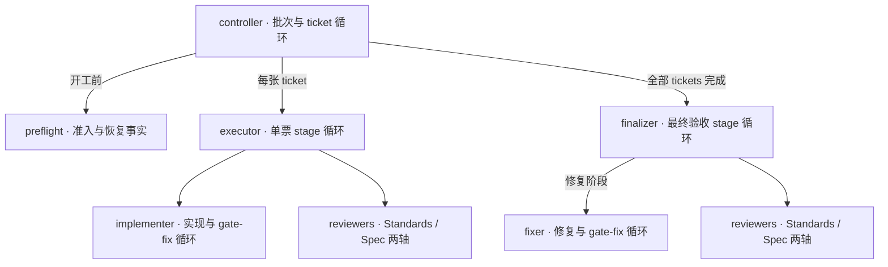

# Beadwork 架构

本文用于快速理解角色分工。执行细节以 [beadwork-run](../skills/beadwork-run/SKILL.md) 及其引用的协议为准；目标项目的接入方式见 [project-contract.md](project-contract.md)。

## 总体关系

一个 parent 对应一个批次：**准入检查 → 串行完成 tickets → 最终验证与修复 → 合入本地 main 并收尾**。

下图箭头表示直接派发关系；子角色向派发者交付结果。controller 是顶层协调者，由 skill 主流程承担。

implementer/fixer 完成并停止写入后，才开始对应 review；两轴 reviewer 可并行，源码 writer 同一时刻只有一个。

## 角色职责

| 角色与规则入口 | 负责什么 | 交付给谁 |
| --- | --- | --- |
| [controller](../skills/beadwork-run/SKILL.md) | 选择、领取、关闭 tickets；环境准备、Git/worktree 生命周期、整票与最终交付验收、集成收尾；独占 Beads 写入 | 用户 |
| [preflight](../skills/beadwork-run/agents/preflight.md) | 固定 children 范围，核对工具链、recipes、spec/Test plan 和恢复事实；只写证据 | controller：`READY` / `BLOCKED` |
| [executor](../skills/beadwork-run/agents/ticket-executor.md) | 协调整张 ticket；管理 stages、计划适配、实现语义验收与双轴 review；只写证据 | controller：`DONE` / `NEEDS_CONTEXT` / `BLOCKED` |
| [implementer](../skills/beadwork-run/agents/implementer.md) | 当前 stage 的源码实现、测试、分层提交和交付 gates；自行处理阶段内 gate-fix | executor：实现结果与验证证据 |
| [reviewer](../skills/beadwork-run/agents/reviewer.md) | 按 Standards 或 Spec 轴独立只读审查；提供原始 findings | executor 或 finalizer：本轴报告 |
| [finalizer](../skills/beadwork-run/agents/finalizer.md) | 汇总批次边界；管理最终 stages、修复语义验收与双轴 review；stage 0 自行跑最终 gates | controller：`READY_TO_MERGE` / `BLOCKED` |
| [fixer](../skills/beadwork-run/agents/fixer.md) | 最终修复 stage 的唯一源码 writer；修复批次阻塞、提交并完成最终 gates，自行处理 gate-fix | finalizer：修复结果与验证证据 |

`READY` 不代表已安装、冒烟或领取；implementer/fixer 的 `DONE` 不代表 review 通过；reviewer 的 `COMPLETED` 只表示审查完成，是否通过由 findings 决定。最终合入由 controller 执行。

## 三层循环

| 层次 | 谁管理 | 推进规则 |
| --- | --- | --- |
| ticket | controller | 当前票验收完成后，重新计算依赖图并选择下一票；每票使用全新 executor |
| stage | executor / finalizer | 代码失败进入下一阶段；每阶段至多一轮完整双轴 review。ticket 从 stage 0 实现；最终验收 stage 0 无 writer，stage 1..3 才派 fixer |
| gate-fix | implementer / fixer | 当前 writer 在同一 stage 内修正交付 gate 的代码失败；用尽机会仍失败才交回上层 |

阶段与 gate-fix 的额度由脚本绑定；session 接替不等于新阶段。中断接续原阶段，环境/spec/seam 等非代码阻塞保留证据并停止。具体次数与恢复输入见角色协议。

## 验收与实现边界

- **agent 判断语义，脚本校验事实。** executor/finalizer 负责需求、修复处置、验证覆盖和 review 的日常语义验收；controller 核对交付与集成条件，遇到矛盾、缺证或越界迹象再追查。
- **验证由当前执行者负责。** ticket gates 由 implementer 执行；最终 stage 0 由 finalizer 执行，修复阶段由 fixer 执行。相同 HEAD 的完整有效结果复用。
- **报告可追溯。** 使用文件报告、短回执及 SHA-256 来源绑定；直接派发者验收子角色。报告与更正 append-only，回执不替代任务停止确认。详见 [交付协议](../skills/beadwork-run/references/report-delivery.md)。
- **源码与协议各有入口。** `skills/` 是 skill 源码；[scripts/](../skills/beadwork-run/scripts/) 实现身份、计数、状态和证据校验，不派发 agent；[共享测试契约](../skills/beadwork-run/references/testing-contract.md) 定义测试规则，目标项目的 `justfile` 定义实际验证命令。本文不复制这些协议。
