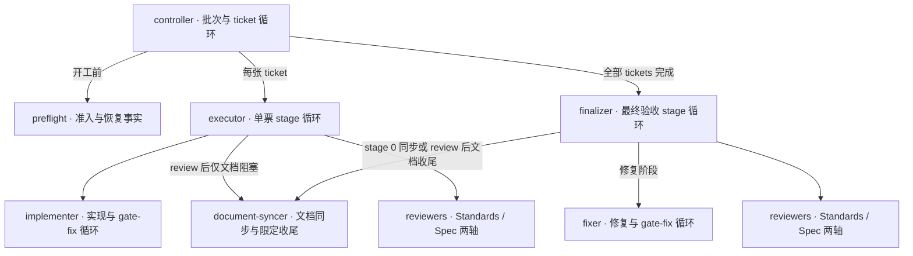
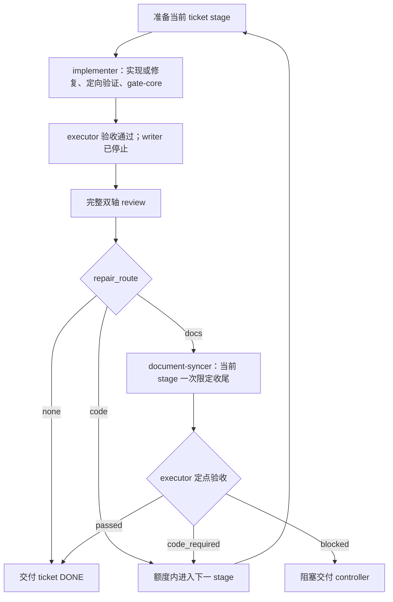
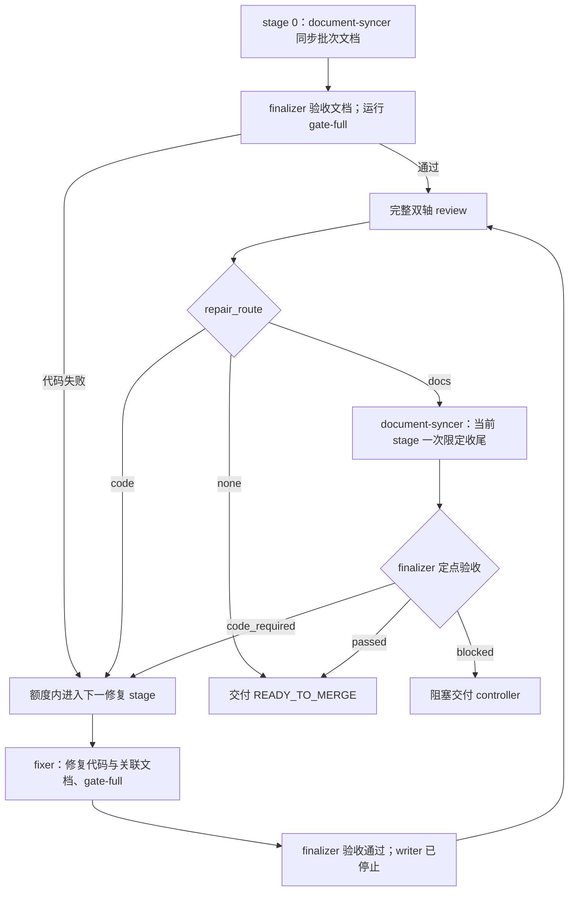

# Beadwork 架构

本文用于快速理解角色分工、executor/finalizer 的执行流程和验收边界。执行细节以 [beadwork-run](../skills/beadwork-run/SKILL.md) 及其引用的协议为准；目标项目的接入方式见 [project-contract.md](project-contract.md)。

## 总体关系

一个 parent 对应一个批次：**准入检查 → 串行完成 tickets → 最终验证与修复 → 合入本地 main → 关闭 parent → 清理**。交付保留在本地，不执行 Git 或 Beads push。

下图箭头表示直接派发关系；子角色向派发者交付结果。controller 是顶层协调者，由 skill 主流程承担。

审查前的实现、批次文档同步或代码修复完成并停止写入，且验证通过后，才开始完整 review；两轴 reviewer 可并行，源码 writer 同一时刻只有一个。review 后的文档收尾由直接派发者定点验收，不再启动完整 review。

## 角色职责

| 角色与规则入口 | 负责什么 | 交付给谁 |
| --- | --- | --- |
| [controller](../skills/beadwork-run/SKILL.md) | 选择、领取、关闭 tickets；环境准备、Git/worktree 生命周期、整票与最终交付验收、本地集成与收尾；独占 Beads 写入 | 用户 |
| [preflight](../skills/beadwork-run/agents/preflight.md) | 固定 children 范围，核对工具链、recipes、spec/Test plan 和恢复事实；只写证据 | controller：`READY` / `BLOCKED` |
| [executor](../skills/beadwork-run/agents/ticket-executor.md) | 协调整张 ticket；管理 stages、计划适配、实现语义验收、双轴 review 与文档收尾；只写证据 | controller：`DONE` / `NEEDS_CONTEXT` / `BLOCKED` |
| [implementer](../skills/beadwork-run/agents/implementer.md) | 当前 stage 的源码实现、测试、分层提交和交付 gates；自行处理阶段内 gate-fix | executor：实现结果与验证证据 |
| [reviewer](../skills/beadwork-run/agents/reviewer.md) | 按 Standards 或 Spec 轴独立只读审查；提供原始 findings | executor 或 finalizer：本轴报告 |
| [finalizer](../skills/beadwork-run/agents/finalizer.md) | 汇总批次边界；管理最终 stages、修复语义验收、双轴 review 与文档收尾；stage 0 自行跑最终 gates | controller：`READY_TO_MERGE` / `BLOCKED` |
| [document-syncer](../skills/beadwork-run/agents/document-syncer.md) | stage 0 检查批次文档影响；review 后仅文档阻塞时完成一次限定修复，不修产品代码，不组织 review | executor/finalizer：文档结果与检查证据 |
| [fixer](../skills/beadwork-run/agents/fixer.md) | 最终修复 stage 的唯一源码 writer；修复批次阻塞、提交并完成最终 gates，自行处理 gate-fix | finalizer：修复结果与验证证据 |

`READY` 不代表已安装、冒烟或领取；implementer/document-syncer/fixer 的 `DONE` 不代表上层验收通过；reviewer 的 `COMPLETED` 只表示审查完成，是否通过由 findings 决定。最终合入由 controller 执行。

## 执行流程

### Executor：单票实现与验收

executor 接手一张已领取的 ticket。stage 0 与后续代码修复 stage 均由 implementer 写入，完成定向验证、提交和干净候选的 `gate-core`；executor 验收实现证据后，才派发 Standards / Spec 两轴 reviewer。review 的 BASE 始终是原 ticket base_commit。

图中 review 以实现验收与两轴审查均完成为前提。阶段内的 gate-fix、额度耗尽和非代码阻塞按下文三层循环处理；未满足前提时不能沿成功路径交付。完整协议见 [ticket 执行](../skills/beadwork-run/references/ticket-execution.md)。

### Finalizer：批次最终验收

全部 tickets 完成后，finalizer 在 stage 0 先派 document-syncer 检查并同步整个批次的文档，验收后自行运行 `gate-full`。后续代码修复 stage 由 fixer 同时修复代码与关联文档、完成 `gate-full`，再由 finalizer 验收。两种入口均在验证通过后进入双轴 review，BASE 为 reviewed_main。

stage 0 的批次文档同步是审查前的必经步骤；review 后的文档收尾只处理已指出的问题，不能替代前者或初次完整 gate。额度耗尽、文档同步验收失败、审查未完成或非代码阻塞均保留证据并停止；`READY_TO_MERGE` 之后仍由 controller 核对并执行本地集成。完整协议见 [最终执行](../skills/beadwork-run/references/final-execution.md)。

### 共用分流与文档收尾

reviewer 为每条 finding 标注 `repair_scope: code | docs`，收集后根据两轴的 blocking findings 汇总 `repair_route`；非阻塞建议不触发修复循环。

| 完整双轴 review 的结果 | 后续处理 |
| --- | --- |
| 无 blocking findings：`none` | 正常完成当前阶段并交付 |
| 至少一项代码阻塞：`code` | 沿原额度进入下一代码修复 stage；代码与文档混合问题也走此分支 |
| 全部阻塞均为文档问题：`docs` | 当前 stage 派一次 document-syncer，直接派发者定点验收 |

文档分类取决于修改的语义。仅补齐已实现行为的说明可以收尾；涉及产品行为、测试、配置、构建逻辑或 skill 执行协议的变化属于代码范围，不能仅凭 `.md` 后缀跳过代码验证。两轴未完成、需求不明确时阻塞，不进入文档收尾。

document-syncer 只修原 findings 和限定范围内的直接关联文档，并执行适用的文档检查。executor/finalizer 逐项核对原阻塞是否解决、实际 diff 是否越界、检查是否充分；不扩展为新一轮全票或全批次 review，不重跑 `gate-core` / `gate-full`。通过采集器执行的每项文档检查须在最终干净 HEAD 有通过记录，不能用新提交或更换参数掩盖失败。

一次收尾允许 writer 在任务内编辑、自查和修正，但只有一次最终验收：`passed` 继续交付；`blocked` 保留原因交回 controller，不自动再派 writer 或 reviewer；`code_required` 说明必须修代码的依据，确认 writer 停止且现场干净后沿原额度进入下一代码修复 stage。中断且未交付的任务接续原 dispatch；新 stage 的 review 可再次按上述规则分流。

原代码候选 H1 的 gate 与 review 保持原样，文档提交 H1 → H2 由独立收尾记录和逐项验收覆盖，最终交付 H2。原 BLOCKED findings 不改写为 PASS，也不声称代码 gate 在 H2 运行过；只有通过的文档收尾才允许复用 H1 的代码验证。命令、输入字段和证据绑定见 [文档收尾协议](../skills/beadwork-run/references/document-closeout.md)。

## 三层循环

| 层次 | 谁管理 | 推进规则 |
| --- | --- | --- |
| ticket | controller | 当前票验收完成后，核对固定执行序列及实时依赖，只选择下一张未完成票；每票使用全新 executor |
| stage | executor / finalizer | 需要继续修代码时按额度进入下一阶段；每阶段至多一轮完整双轴 review。ticket 的实现与修复均派 implementer；最终 stage 0 派 document-syncer 后由 finalizer 运行完整 gate，后续修复派 fixer。纯文档收尾留在当前 stage |
| gate-fix | implementer / fixer | 当前 writer 在同一 stage 内修正交付 gate 的代码失败；用尽机会仍失败才交回上层 |

阶段与 gate-fix 的额度由脚本绑定；session 接替不等于新阶段。中断接续原阶段，环境/spec/seam 等非代码阻塞保留证据并停止。具体次数与恢复输入见角色协议。

## 验收与实现边界

- **agent 判断语义，脚本校验事实。** executor/finalizer 负责需求、修复处置、验证覆盖和 review 的日常语义验收；controller 核对交付与集成条件，遇到矛盾、缺证或越界迹象再追查。
- **验证由当前执行者负责。** controller 在初始化和改变 HEAD 的票间同步建立 `gate-core` 快速基线；ticket 的定向行为验证和干净候选 `gate-core` 由 implementer 执行；最终 stage 0 由 finalizer 执行一次完整 `gate-full`，修复阶段由 fixer 重新执行该入口。相同 HEAD 的完整有效结果复用；纯文档收尾保留原代码候选 gate/review 的 HEAD，由独立收尾记录覆盖文档交付 HEAD。
- **报告可追溯。** 使用文件报告、短回执及 SHA-256 来源绑定；直接派发者验收子角色。报告与更正 append-only，最终阶段检查点固定文档同步/fixer/review/阶段报告选择；验证绑定原始运行，本票行为覆盖由 executor/reviewer 核对。派发者记录收尾观察，回执不替代任务停止确认。详见 [交付协议](../skills/beadwork-run/references/report-delivery.md)。
- **源码与协议各有入口。** `skills/` 是 skill 源码；[scripts/](../skills/beadwork-run/scripts/) 实现身份、计数、状态和证据校验，不派发 agent；[共享测试契约](../skills/beadwork-run/references/testing-contract.md) 定义测试规则，目标项目只需提供 `install`、`test`、`gate-core`、`gate-full` 四个 just 入口，内部 suite、格式化和静态检查由项目维护。具体参数与行为见接入契约。

## 脚本入口与内部依赖

公开 CLI 保持稳定，内部按事实、状态、报告和操作分组。下表用于源码维护；命令参数仍以 skill 引用的执行协议为准。

| 分组 | 入口与实现 | 职责 |
| --- | --- | --- |
| 公开入口 | [beadwork.py](../skills/beadwork-run/scripts/beadwork.py) → [cli.py](../skills/beadwork-run/scripts/cli.py) | 唯一公开 Python CLI、Python 下限检查、argparse 路由、JSON 与退出码边界 |
| 顶层操作 | [controller.py](../skills/beadwork-run/scripts/controller.py)、[executor_operations.py](../skills/beadwork-run/scripts/executor_operations.py) | 批次验收与集成；多角色操作、现场检查 |
| 操作编排 | [ticket_execution.py](../skills/beadwork-run/scripts/ticket_execution.py)、[finalization.py](../skills/beadwork-run/scripts/finalization.py)、[document_sync.py](../skills/beadwork-run/scripts/document_sync.py)、[document_closeout.py](../skills/beadwork-run/scripts/document_closeout.py)、[review_operations.py](../skills/beadwork-run/scripts/review_operations.py) | 阶段准备、验收后选择、review 准备与收集、最终交付 |
| 状态 | [ticket_state.py](../skills/beadwork-run/scripts/ticket_state.py)、[final_state.py](../skills/beadwork-run/scripts/final_state.py)、[gate_repair.py](../skills/beadwork-run/scripts/gate_repair.py) | 检查点、当前 writer、来源选择、冻结和额度 |
| 报告与只读来源 | [ticket_reports.py](../skills/beadwork-run/scripts/ticket_reports.py)、[implementer_reports.py](../skills/beadwork-run/scripts/implementer_reports.py)、[fixer_reports.py](../skills/beadwork-run/scripts/fixer_reports.py)、[review_evidence.py](../skills/beadwork-run/scripts/review_evidence.py) | 组装候选报告并校验字段、Git 事实和原始来源；不推进阶段 |
| 验证 | [run_verification.py](../skills/beadwork-run/scripts/run_verification.py)、[ticket_verification.py](../skills/beadwork-run/scripts/ticket_verification.py)、[final_verification.py](../skills/beadwork-run/scripts/final_verification.py)、[report_io.py](../skills/beadwork-run/scripts/report_io.py) | 运行采集与报告读取分开；ticket/final 各自判断覆盖；内部 verifier facade 直接调用各报告校验实现 |
| 基础契约 | [evidence.py](../skills/beadwork-run/scripts/evidence.py)、[repository.py](../skills/beadwork-run/scripts/repository.py)、[dispatch_contract.py](../skills/beadwork-run/scripts/dispatch_contract.py) | 文件绑定、仓库事实、dispatch 身份与计划；不依赖阶段编排或报告校验实现 |
| 其他操作 | [preflight_operations.py](../skills/beadwork-run/scripts/preflight_operations.py)、[plan_operations.py](../skills/beadwork-run/scripts/plan_operations.py)、[graph.py](../skills/beadwork-run/scripts/graph.py)、[tracker_operations.py](../skills/beadwork-run/scripts/tracker_operations.py)、[batch_initialize.py](../skills/beadwork-run/scripts/batch_initialize.py)、[batch_evidence.py](../skills/beadwork-run/scripts/batch_evidence.py) | 准入、串行计划、依赖图、tracker intent、批次初始化和批次证据 |

外部报告校验统一使用 `beadwork.py verify ticket|phase|worker`，实现分别位于 [verify_ticket.py](../skills/beadwork-run/scripts/verify_ticket.py)、[phase_validation.py](../skills/beadwork-run/scripts/phase_validation.py) 和 [worker_validation.py](../skills/beadwork-run/scripts/worker_validation.py)。工作流内部通过 Python API 直接调用校验实现，避免为 schema 或报告检查重复启动解释器。`self_check_argv` 由 [command_argv.py](../skills/beadwork-run/scripts/command_argv.py) 统一构造，不经过 shell。完整门禁由根目录 justfile 编排；Python 静态检查由 Ruff 和 ty 承担，必要分发资源与调用策略由 distribution 测试覆盖。文档内容与实现、协议的一致性由 review 核对。

`handoff.py` 维护 context/closure 证据；schema、模型政策、进程组和运行记录分别由既有基础模块维护。基础模块与报告读取不反向导入 controller/executor 入口；状态模块不调用阶段编排；verifier facade 不使用动态 import 掩盖依赖方向。独立分发与安装入口由 `test_distribution.py` 验证。

验证来源由 `verification_records.py` 统一发现和读取；ticket 的固定快照逐条解析一次，同时供报告摘要和 gate 覆盖判断使用。缺失 started 也有明确的目录身份，只能形成部分阻塞交付。新报告检查当前来源完整性，历史报告不重新扫描新增运行。具体快照契约见[验证采集](../skills/beadwork-run/references/verification.md)。

单次 stage 验收显式传递已核验的 checkpoint 状态，并按 reviewer dispatch/report/receipt 的内容复用成功校验；跨命令不保留缓存，closure 和当前调用方身份仍逐次检查。checkpoint 直接保存累计 gate 状态，读取时不再从旧报告补字段。fixer 的固定验证来源由 worker verifier 检查一次，调用方继续检查当前来源完整性、Git 现场与收尾证据。

源码拆分的范围与验证结果见[实施方案](plans/script-modularization-plan.md)及[验收记录](acceptance/script-modularization-acceptance.md)。正常流程的历史精简见[改造计划](plans/normal-flow-simplification-plan.md)。当前初始化由 `beadwork.py batch-initialize` 调用 `batch_initialize.py` 完整执行；清理直接校验本地 merge checkpoint 与现场；角色只填写生成的 draft 输入契约。

串行顺序由 parent 的 `ticket_order` 区块声明；`execution_plan.py` 负责解析、依赖与状态校验、批次计划来源链，`beadwork.py plan` 提供发布和显式接纳入口。`expected_children` 仍表示成员集合。详见[串行规划契约](../skills/beadwork-run/references/serial-planning.md)。

## 模型读取与交接

prepare 按角色、有效 Test plan 和 review 轴生成 `required_reads`，角色入口保留职责和正常步骤，特殊恢复与模型扩展按条件加载。writer 的交付命令集中在 [writer-delivery.md](../skills/beadwork-run/references/writer-delivery.md)。

读取与语义输入分别由 `role_instructions.py` 和 `draft_contracts.py` 维护：前者选择当前角色需要的协议，后者生成 `draft_schema_path`。executor root 先读协调协议，准备或恢复 stage 后再按当前有效 Test plan 加载测试规则；计划适配同时刷新 stage 和 implementer 清单。reviewer 按 axis、ticket/batch scope 和测试模式读取，不继承派发者对话。脚本只生成派发材料，真正的 agent 创建、等待和停止观察仍由直接派发者完成。

ticket 与最终修复均提供 `active_stage_context_source`。最终 fixer dispatch 使用阶段绑定保留历史入口，默认读取当前 blockers、findings、前阶段验证视图和直接处置。`final_active_context.py` 在恢复与 fixer 验收时重新核对内容来源。

正常 accept 可直接接收 `--observation`，内部保存 closure 并执行既有验收；已有 closure 仍可显式复用。review-prepare 返回 selection 草稿，review-collect 保存两轴观察及原始来源。任务停止仍由派发者实际观察。相关范围与验证见[注意力减负方案](plans/model-attention-refactoring-plan.md)。

当前交接链为 `dispatch → draft/report → receipt + closure → checkpoint 选择 → 上层交付`。dispatch 固定角色、范围、模型和来源；report 保存事实与语义判断，receipt 绑定报告内容，closure 记录派发者观察；checkpoint 决定恢复与推进时采用哪个版本。旧文件存在或收到成功回执，都不等于来源已被验收选中。

工作流与执行证据不维护版本号或版本校验。skill 优化按全新 flow 设计，不提供跨版本现场适配或历史迁移。正常流程原有的身份、来源和 append-only 证据约束保持不变。

紧凑验证视图按 `started_ns` 排序后选择最早失败、最新命令结果与当前 HEAD 的交付结果；随机证据目录名不代表时间顺序。完整运行来源仍保留绑定。fixer 恢复和 finalizer 补充验证共同要求当前 writer 的自报与派发者观察均确认停止；passed/code_failure 的 writer 保持终态冻结，blocked/interrupted 在收尾确认后恢复原阶段。
