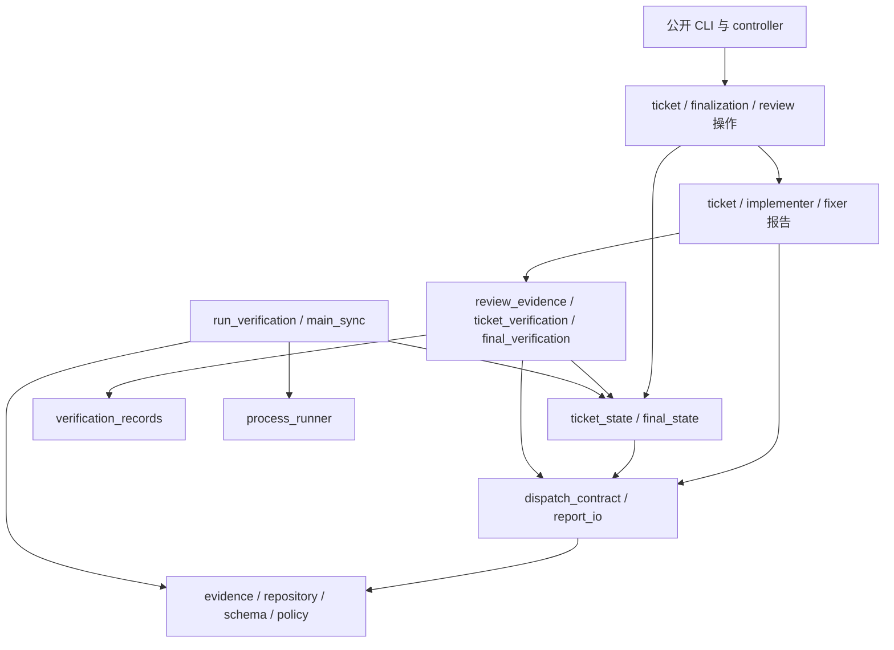

# Beadwork 脚本职责拆分与依赖整理方案

日期：2026-09-16。

状态：已实施并验收（2026-09-17）。A0–A9 均完成，A8 按触发条件局部实施；逐步检查、修正记录和验证边界见[验收记录](../acceptance/script-modularization-acceptance.md)。

## 1. 目标、基线与范围

本轮目标是让维护者能够从稳定 CLI 找到对应职责，并在修改某个职责时不必同时理解 controller、ticket、finalization 和验证采集的全部实现。采用行为保持的局部重构，优先消除被覆盖的旧实现和反向依赖，再按状态、报告、编排拆分较大的模块。

分析基线为 Git HEAD `06f9190660a3e2dee433221574d8a9ba84f813cf`。编写本文前工作区干净；用户级 `~/.agents/skills/beadwork-run` 解析到仓库内的 `skills/beadwork-run`。实施前必须重新核对 HEAD、工作区 diff 和真实安装路径，不能假定它们仍与本文相同。

统计范围是 `skills/beadwork-run/scripts/` 下的 Python 文件；行数包含注释和空行。

| 项目 | 基线 |
| --- | ---: |
| Python 文件总数 | 47 |
| 生产文件 | 29 个，5,690 行 |
| 测试文件 | 18 个，4,416 行 |
| 最大生产文件 | `ticket_execution.py`，640 行 |
| 其他较大生产文件 | `controller.py` 628 行；`finalization.py` 578 行；`verify_ticket.py` 564 行；`executor_operations.py` 470 行 |

方案编写时的证据来自源码、AST import/函数统计、CLI 路由与协议读取，以及 `verify_ticket` 导出函数的运行时归属检查。当时尚未运行完整回归；实施期间的实际回归与完成状态见[验收记录](../acceptance/script-modularization-acceptance.md)，不把更早的历史测试数量或耗时作为本轮验收结果。包含函数内延迟 import 的静态图中，以下 10 个模块处于同一强连通分量：

```text
controller, executor_operations, ticket_execution, finalization,
final_state, final_verification, gate_repair, handoff,
main_sync, run_verification
```

这是维护耦合的证据，不代表这些模块当前无法导入或已有运行故障。

### 1.1 与已有方案的关系

- [脚本化与重构实施计划](script-automation-refactoring-plan.md)及[验收记录](../acceptance/script-automation-refactoring-acceptance.md)已经覆盖证据、进程、schema、策略等基础模块抽取。本轮继续使用这些模块，不重新实现 G01–G20，也不重新打开已经完成的行为修复。
- 原方案 G10 已完成可普通 import 的实现模块和兼容 CLI 包装。本轮进一步收敛这些实现模块内部的职责和依赖。
- 原验收记录已取消普通 fixture 的全量迁移。本轮将 fixture 整理限定在受影响测试，不把所有测试类改写成普通 helper 作为完成条件。
- [性能测量记录](../testing/script-performance-measurement.md)没有证明需要跨命令缓存。本轮不增加缓存，不承诺测试提速。
- 角色权限以[架构概览](../ARCHITECTURE.md)和 skill 现行协议为准，结构调整不改变角色职责。

### 1.2 方案选择

| 方案 | 收益 | 代价与局限 | 决策 |
| --- | --- | --- | --- |
| 仅删除旧 schema 副本 | 风险小，消除误改入口 | 业务入口仍被当作基础库，循环依赖保留 | 作为第一步 |
| 下沉基础能力，按状态、报告、编排局部拆分 | 能对应现有职责，减少跨模块理解成本 | 需要迁移内部调用并做协议回归 | 本方案采用 |
| 整体迁移 package/目录、重命名 CLI、建立通用状态机 | 表面结构更统一 | 影响安装、证据内 argv、测试发现和历史恢复，当前收益不足 | 不实施 |

不设置文件超过 500 行必须拆分的规则。拆分必须形成可描述的职责边界或移除实际反向依赖；不以减少行数、新增文件数量或消灭所有重复条件为目标。

## 2. 必须保持的契约

1. 保留 Python 标准库实现和现行最低 Python 版本声明，不引入框架、常驻服务或运行时注册中心。
2. 保留公开脚本文件名、子命令、参数、stdout/stderr JSON、退出码含义及生成 dispatch 中的 `self_check_argv`。
3. 保留固定 branch/worktree 布局、证据目录与命名、报告/receipt/schema 字段、协议版本和模型/额度规则。
4. 不改写历史 dispatch、checkpoint、report、receipt、started/result/log、context 或 closure；不因恢复升级而重新计算新的执行额度。
5. controller 独占 Beads 写入和 Git/worktree 生命周期；脚本不派发 agent。搬迁 Git helper 不扩大调用者权限。
6. 保留 ticket/stage/gate-fix 三层推进规则、review 后冻结、同 HEAD 报告更正、累计 gates 和已有行为交付规则。
7. 直接派发者的 closure 来源仍为推进必要证据；进程组退出和 receipt 不替代宿主任务停止确认。
8. 当前严格协议与 legacy 路径保持原来的选择条件。不能通过缺少字段、异常捕获或默认值把当前协议降级到历史宽松路径。
9. 报告结构校验、来源/状态校验、live Git 验收保留各自覆盖；不因抽出公共函数而删掉独立入口原有检查。
10. 不把 `batch_initialize.py` 提升为默认初始化入口；不修改目标项目业务代码、Beads 数据或验证 recipes。

## 3. 公开入口与逻辑分组

### 3.1 公开 CLI 保持表

下表是当前入口清单。实施基线另需从实际 parser/分发表保存完整命令与参数清单，尤其是循环注册的子命令，不能只搜索字面量 `add_parser`。

| 入口 | 命令或职责 | 重构后的归属 |
| --- | --- | --- |
| `controller.py` | `prepare`、`update-main`、`sync-main`、`adapt-plan`、`accept`、`comment`、`merge`、`cleanup` | 顶层批次准备、验收与集成；基础能力下沉 |
| `preflight-operations.py` | `collect`、`assemble` | 准入事实采集与报告组装 |
| `graph.py` | `check-flat`、`next` | 只读依赖图判定 |
| `tracker_operations.py` | `prepare`、`execute` | controller 专用 tracker intent、写入与读回 |
| `executor-operations.py` | `inspect`、`check-layer`、`assemble`、`check` | 保留兼容入口，路由到现场检查或 ticket 报告实现 |
| 同上 | `ticket-stage`、`ticket-adapt-plan`、`ticket-assemble`、`ticket-deliver` | ticket 编排与报告 |
| 同上 | `implementer-assemble`、`implementer-check`、`implementer-accept` | implementer 报告与 ticket 选择状态 |
| 同上 | `final-stage`、`final-gates`、`final-assemble`、`final-deliver` | finalization 编排与状态 |
| 同上 | `fixer-assemble`、`fixer-check`、`fixer-accept` | fixer 报告与 final 选择状态 |
| 同上 | `review-prepare`、`review-collect` | review 操作；ticket/final 各自维护选择状态 |
| 同上 | `context-add`、`handoff-close`、`begin-gate-repair` | 交接证据与 gate 修复 |
| `run-verification.py` | recipe 执行、`--delivery`、参数透传 | 验证运行准入、执行与证据采集 |
| `verify-ticket.py` | schema、receipt schema、报告检查、完整 Git 验收 | executor 报告验收 |
| `verify-phase.py` | preflight/finalizer schema 与报告检查 | phase 验收 |
| `verify-worker.py` | implementer/fixer/reviewer schema 与报告检查 | worker 验收 |
| `batch_initialize.py` | `prepare`、`execute` | 辅助初始化及已有 intent 恢复，保持非默认地位 |
| `batch_evidence.py` | `inspect`、`manifest`、`summary` | 批次事实与来源汇总 |
| `maintenance_check.py` | `docs`、`scripts`、`full` | 本仓库维护检查 |

已有 `executor-operations.py`、`run-verification.py`、`verify-ticket.py` 三个薄包装保留。下划线实现模块可以继续支持既有直接执行方式，避免无关兼容性收缩；本轮不为所有文件强行补一层包装。

### 3.2 保留的基础模块

| 模块 | 维护职责 | 禁止引入的依赖 |
| --- | --- | --- |
| `evidence.py` | 严格 JSON、hash、路径、binding、append-only 发布 | controller、阶段编排、角色报告 |
| `process_runner.py` | 进程组、信号、日志与终态 | ticket/final 状态和语义 |
| `verification_records.py` | started/result/log 快照及来源读取 | recipe 成功政策、阶段推进 |
| `schema_validation.py` | 受控 schema 引擎和基础 schema 常量 | 业务编排 |
| `review_schema.py` | AxisReport schema | review 准备/选择状态 |
| `workflow_policy.py` | 模型与额度常量 | Git、CLI、工作流状态 |

### 3.3 目标模块与迁移映射

新增名称为本方案的默认落点；只有发现职责明显重叠时才合并，并在验收记录解释。现有文件继续位于同一 `scripts/` 目录，不做 package 化迁移。

| 模块 | 主要来源 | 目标职责与边界 |
| --- | --- | --- |
| 新增 `repository.py` | controller 的 `run/git/status/sha/primary/topology/primary_writable/check_batch_beads`；executor 的 `paths/workspace` | 命令执行和仓库事实检查；不负责 merge、cleanup、tracker 写入或阶段推进 |
| 新增 `dispatch_contract.py` | executor 的 `dispatch/output_path`；controller 的 `validate_plan`；ticket 的 `same_ticket`；final 的 `same_attempt` | dispatch 路径、身份、计划来源和输出位置检查；只读取证据，不选择当前阶段 |
| 新增 `report_io.py` | controller 的 `verifier`；各角色 worker CLI 调用；通用 dispatch/report/receipt 来源读取 | 有限的现有 verifier 调用与结果读取，保留各 CLI 的错误语义；不承担业务成功判定 |
| 新增 `review_evidence.py` | executor 的 `pair_from_sources/collection` | 读取和重验双轴原始来源及 collection，推导 PASS/BLOCKED；不准备 round、不修改 checkpoint |
| 扩充 `review_operations.py` | executor 的 `reviewed_state/prepare_review/collect_review`；handoff 的 `review_inputs` | review 准备、材料发布、收集及对状态模块的显式调用；依赖只读 review evidence |
| 新增 `ticket_state.py` | ticket 的 root/checkpoint/source/选择函数及 `require_writer` | ticket 状态链、来源读取、当前 writer、round 预留/绑定/选择；不调用报告完整验收或阶段编排 |
| 新增 `ticket_verification.py` | ticket 的 `runs/verification_snapshot/collect_verification`；run_verification 的 `collect` | ticket 验证历史读取与报告行生成；复用 verification records，保留现有文本、顺序和异常语义；不执行 recipe |
| 新增 `implementer_reports.py` | ticket 的 `implementer_schema/implementer_errors/check_implementation/implementer_check/implementer_assemble` | implementer schema、事实检查、报告组装；读取状态，不选择 worker 或推进 stage |
| 新增 `ticket_reports.py` | controller 的 `check_stage_report_core`；executor 的 `assemble/check_report`；ticket 的 `check_selected_review/check_stage/check_ticket` 和报告组装主体 | executor/stage/root 报告组装和校验；依赖 implementer 报告与只读 review evidence，不调用 ticket 编排 |
| 收敛 `ticket_execution.py` | 保留 `prepare_stage/accept_implementer/review_ready/deliver/adapt_plan` 等操作；接收 controller 的 ticket 阶段准备及计划适配业务 | ticket 操作顺序、验收后选择与发布；调用 state/reports，不向底层提供通用 helper |
| 收敛 `final_state.py` | 现有状态函数；finalization 的 `require_writer` | final 检查点与当前 fixer 准入；身份检查来自 dispatch contract，不反向调用 finalization |
| 新增 `fixer_reports.py` | finalization 的 `read_fixer/fixer_check/fixer_assemble` | fixer 报告、提交与验证事实；`accept_fixer` 仍由 finalization 更新选择状态 |
| 收敛 `finalization.py` | attempt/stage、accept_fixer、review_ready、阶段报告和最终交付 | 最终验收编排；legacy 导入先提取为本文件命名函数，不立即另建 legacy 包 |
| 收敛 `final_verification.py` | 保留现有验证覆盖函数 | 依赖 final_state/dispatch_contract/gate_repair 的事实接口，不从 finalization 获取身份 helper |
| 收敛 `handoff.py` | 保留 preflight 来源、context、closure | 证据与直接派发者观察；review 输入组装迁出；preflight 重验不再调用 controller.inspect |
| 收敛 `executor_operations.py` | CLI parser/dispatch；`inspect_context/check_layer` | 现有多角色入口的路由与局部现场操作；其余生产模块不反向 import 它 |
| 收敛 `controller.py` | prepare、inspect、accept、comment、main 同步代理、merge、cleanup、CLI | 顶层操作；其他生产模块不反向 import 它 |

`report_io` 只对固定角色和现有调用方式提供命名函数，不实现可插拔 validator registry。只有几十行且职责单一的函数集不再继续细分。错误断言可以保留少量本地 helper，不另建通用 `utils.py`。

## 4. 依赖方向和容易遗漏的回路

总体允许方向如下。图表示依赖层次，不表示每个模块都需要依赖下一层的全部模块。



### 4.1 逐条断开当前回路

| 当前回路 | 调整方式 | 验收条件 |
| --- | --- | --- |
| controller ↔ 各业务模块 | 迁出 IO、Git、dispatch/plan、verifier helper；业务模块直接引用所属模块 | 生产业务模块不再 import controller，也不通过动态加载回调它 |
| executor_operations ↔ ticket/finalization | 报告与 review 分离，binding/load 直接用 evidence | ticket/final 不再经 `ops()` 获取入口模块能力 |
| ticket_execution ↔ run_verification | `collect` 与 ticket 验证读取迁入 ticket_verification；运行准入只调用 ticket_state | 报告读取不 import 运行入口，运行入口不 import ticket 编排 |
| gate_repair ↔ ticket/finalization | writer 准入分别放入 ticket_state/final_state | gate 修复只能依赖状态与基础事实，不调用报告组装或阶段推进 |
| final_verification ↔ finalization | `same_attempt` 移至 dispatch_contract | 最终验证仍检查相同身份字段，但不依赖编排模块 |
| handoff ↔ ticket_execution | review_inputs 迁到 review_operations，ticket 状态来源读取使用 ticket_state | handoff context/closure 不依赖 ticket 编排 |
| handoff → controller.inspect | 提取 preflight 路径所需的目录、schema、receipt、hash 重验，使用 report_io | preflight_input 保留原检查集合，不用“已经验收”跳过原始来源重验 |
| review 读取 ↔ review 准备/业务验收 | review_evidence 只读；review_operations 执行准入、预留和选择 | ticket/final 报告只依赖 review_evidence，不依赖 review_operations |

### 4.2 不可只看 import 图

- `ticket_state.select_review` 需要核对 collection 的身份/绑定，但不能调用完整 ticket 报告验收。完整 collection 重验由调用它的 review 操作完成；保留状态函数原有的身份与当前阶段检查，不能把它变成无条件保存。
- `ticket_reports` 的组装主体返回候选报告/回执后，由 ticket 操作按原顺序写入 receipt 和 checkpoint；不能先选择报告再执行自检。
- `fixer_reports.read_fixer` 必须保留 legacy 与当前 fixer 的既有区别，不能把当前严格检查强行套到全部历史来源。
- `implementer_reports` 的 schema 构造可以继续复用 verify_ticket 的纯 executor schema API；构造 schema 时不得执行 Git、子进程或 checkpoint 扫描。仅导入报告模块不等于调用完整事实验收。
- `report_io → verify-worker → implementer_reports` 的子进程调用必须终止在字段/事实检查路径；该路径不能再次调用同一 worker verifier，避免形成进程递归。现有 worker schema/检查与完整 self-check 的区分必须保留。
- Git helper 合并不能抹掉差异：verify_ticket 的只读 Git 环境、允许退出码，以及 executor 对 NUL 路径和特殊文件名的处理必须原样保留。没有确认等价的调用先保持专用实现。
- 不以把 import 移进函数、改成 `__import__`、传入整个模块对象或增加万能 callback 的方式伪装依赖消除。

目标是生产模块静态依赖图无多模块强连通分量，同时核对 verifier 子进程调用链。扫描应包含函数内 import；CLI 调用边与 import 边分开记录。若实施发现必须保留某一回路，应明确列出并评审原因，不能直接标记结构目标完成。

## 5. 分批实施计划

各批次保持可运行；完成一个批次的针对性验证后再进入依赖它的批次。A0–A7、A9 为本轮主范围，A8 的 fixture 搬迁按触发条件执行。批次是验证与 review 单位，不强制一批对应一次提交，不自动创建 Beads 或执行真实 graph。

| ID | 工作 | 前置 | 主要交付 |
| --- | --- | --- | --- |
| A0 | 固定基线与兼容清单 | 无 | 基线、命令/schema 清单、调用图、回归结果 |
| A1 | 清理覆盖式旧 schema 实现 | A0 | verify_ticket 单一实现来源 |
| A2 | 下沉基础事实、dispatch 和 verifier 调用 | A1 | repository、dispatch_contract、report_io |
| A3 | 分开 review 只读来源与交接证据 | A2 | review_evidence、handoff 去反向依赖 |
| A4 | 提取状态与 ticket 验证读取 | A2、A3 | ticket_state、ticket_verification；gate/运行准入调整 |
| A5 | 拆分 ticket 报告与编排 | A4 | implementer_reports、ticket_reports、ticket_execution 收敛 |
| A6 | 拆分 fixer 报告并整理 finalization | A4 | fixer_reports、finalization/final_verification 收敛 |
| A7 | 收敛 review、CLI 和 preflight 长函数 | A5、A6 | review_operations 集中、入口去反向引用 |
| A8 | 局部测试 fixture 整理 | 随 A2–A7 | 必要 helper 迁移及 cleanup/隔离验证 |
| A9 | 完整验收与维护导航 | A1–A7；适用的 A8 | 全套检查、边界检查、文档和验收记录 |

### A0：固定基线

1. 记录实际 HEAD、工作区 diff、Python 版本和安装真实路径；已有改动单独列出，禁止覆盖。
2. 保存完整 CLI 参数/分发表和各角色 schema；使用现有只读 schema 命令，不执行 prepare、tracker execute、merge 或 cleanup 来盘点入口。
3. 记录生产模块 import 图、被内部调用的旧导出，以及文档/测试中的动态加载和故障注入点。
4. 运行一次完整回归作为本轮基线。存在失败时先归因于基线、环境或本轮改动；不能把失败静默放入排除列表。
5. 从现有回归生成少量临时 legacy/当前协议证据样本，在后续新实现中重验；样本只在临时目录，不引入真实项目证据。

验收：有可以对照的基线，但不要求建立大型 golden 数据库或固定易变的临时路径/UUID/时间戳。

### A1：删除旧 schema 副本

1. 将正式 schema 常量和函数导入移到定义 `RECEIPT/EXPECTED_PLAN` 之前。
2. 删除已被覆盖的 axis_report_schema、schema_errors、check_schema、read_json 等旧函数正文；核对 object_schema 和常量的初始化依赖。
3. 保留 verify_ticket 对现有调用方需要导出的名称；兼容只保留显式别名，不保留第二份实现。
4. 比较 executor、phase、worker 各角色 schema 的解析后对象；不得因这次清理变化。

验证：三个 verifier 套件、严格 JSON/schema 负例、CLI schema 输出、receipt 自检。确保改动前后的拒绝规则一致。

### A2：基础能力与契约下沉

1. 按第 3.3 节迁移基础函数，逐个更新生产调用点。evidence/policy 已有能力直接使用，不通过新模块再次转发。
2. 将 SCRIPTS 定位改为真实源码目录的稳定解析；不要让底层 import controller 只为取路径或 sys。
3. dispatch_contract 保留现有各入口的角色允许集合与计划检查强度。通用加载和特定入口准入分开，不能统一成最宽松集合。
4. report_io 保留 verifier 各模式的 argv、cwd、JSON 及错误返回判断；不统一更改退出码。
5. controller 的 Git 变更操作仍留在 controller/main_sync，repository 只提供事实和命令机制。
6. 迁移 handoff.preflight_input 所需的 preflight 来源重验，逐条对照原 controller.inspect 的 preflight 分支。

验证：controller、main_sync、preflight、baseline adaptation、verifier 与来源篡改负例；真实临时 Git/worktree 验证布局、HEAD、dirty 状态和 `.beads` 检查。此批涉及跨脚本调用，完成后运行完整套件。

### A3：review 来源与 handoff 边界

1. 把 pair_from_sources/collection 放入 review_evidence，保持双轴、receipt、closure、原始 finding、scope 和 HEAD 检查。
2. 将 handoff.review_inputs 移入 review_operations，暂时由旧入口委托，避免 handoff 为组装 reviewer 输入依赖上层编排。
3. ticket/final/controller 的历史 review 校验改为直接读取 review_evidence。
4. 不改变 review 发布顺序、预留 round 时机或故障恢复；这一批只先分开读取与操作。

验证：双轴缺失、跨 ticket/attempt、HEAD 不符、receipt/hash 改动、未收尾 reviewer、existing_behavior 证据、同 round 更正。确认原始 findings 不被重分类或丢弃。

### A4：状态与验证读取

1. ticket_state 接收 checkpoint 链、累计 gates、当前 writer 和 review 选择逻辑；原字段、哈希算法、排序与追加时机保持。
2. final_state 接收 fixer 准入检查；same_attempt 从 dispatch_contract 取得。
3. gate_repair 和 run_verification 的角色准入分别调用对应状态模块，禁止 import ticket_execution/finalization。
4. 将 run_verification.collect 及 ticket 的验证历史读取迁入 ticket_verification。运行入口只运行和记录，报告模块只读取和校验。
5. verification_records 只处理物理来源事实；ticket 与 final 的 gate 覆盖判断继续分别维护。
6. 对 snapshot 中缺失/损坏来源的异常分类、输出顺序、说明文本保持原行为，不借迁移改进错误协议。

验证：checkpoint 断链、修改/丢失来源、旧 writer、review 冻结、同阶段接续、gate-fix 额度、partial BLOCKED、finalizer stage 0/补充验证、SIGTERM/进程组收尾。此批完成后运行完整套件。

### A5：ticket 报告与编排

1. implementer_reports 接收 schema/字段检查和完整报告事实校验；schema 路径不运行外部命令。
2. ticket_reports 接收 executor 报告共用组装、stage/root 校验和旧 stage 报告核心检查；依赖 review_evidence，不调用 review 操作。
3. 将 controller.prepare_stage 的历史阶段准备和 adapt_plan 的业务实现放入 ticket_execution 的明确命名函数，保留 controller 的旧 CLI 代理。
4. ticket_execution 保留操作顺序：准备 stage → writer 交付自检 → closure 验收 → 选择来源 → review → 组装与选择阶段 → root 交付。
5. 将报告计算与状态提交分清，但不扩大中间状态窗口；receipt、自检、checkpoint 的先后顺序对照原实现核验。
6. 清理 `ops()` 和回调 controller/executor 的调用。迁移期兼容别名只允许上层指向下层，最终不得被内部生产路径继续绕用。

验证：完整 ticket public CLI 链、六阶段推进、同阶段恢复、TDD/direct_verification 适配、already_satisfied、累计 gates、selected_review 更正失效、根报告原样交付、controller 最终验收。此批完成后运行完整套件。

### A6：finalization 与 fixer

1. fixer_reports 接收 fixer schema 以外的报告来源、组装和完整检查；现有 verify-worker 中较小的 fixer schema 不强制另移。
2. accept_fixer 留在 finalization，负责调用完整检查和 closure 检查后更新 final_state。
3. prepare_stage 内按新阶段、同阶段恢复、repair 推进、legacy 导入、dispatch 发布提取命名函数。共用输入事实显式传递，不传整个运行模块或使用隐藏全局状态。
4. 同样按来源检查、历史阶段检查、review/fixer 检查和交付覆盖拆解 check_report 的内部步骤；最终仍由一个明确入口执行完整集合。
5. final_verification 直接使用 dispatch_contract 的 attempt 身份和 final_state；不再调用 finalization。
6. 保持 legacy 已 DONE fixer 导入后不再派 writer；保留 stage 0 无 fixer、后续 fixer 唯一和 gate 累计继承。

验证：finalization/handoff/worker/gate-repair 全部相关场景、legacy 两轮 review/已用修复导入、改变 main 后的 attempt 处理、final-deliver 原样绑定、合入前 HEAD 与来源重验。此批完成后运行完整套件。

### A7：入口与局部函数整理

1. review_operations 接管 review-prepare/collect 全流程，调用 ticket/final 的 review 准入及各自 state 预留/选择；ticket/final 报告不再反向调用它。
2. executor_operations 保留 parser、显式分发表、inspect_context/check_layer；不再充当 evidence、报告或 review 来源库。
3. controller 保留顶层 prepare/accept/集成收尾；删除无调用的旧内部转发，必要的兼容名称注明实际实现位置。
4. preflight.collect 在原文件内拆成工具链/recipes、children/Test plan、恢复现场及汇总步骤，保持命令次数、facts/timing 文件和 READY/BLOCKED 规则。不为其额外创建 package。
5. 不强行统一 verify-phase/verify-worker 的文件名和 parser，也不把所有 CLI 收到一个总入口。

验证：完整 CLI 清单对照；任意 cwd、真实安装 symlink 路径、生成 self_check_argv；review 准备中断恢复、preflight 一次采集和错误来源。重新生成依赖图，清除残留反向 import 与动态加载替代品。

### A8：按需整理测试 fixture

触发条件：生产迁移迫使共享 setup/helper 改动，或者测试类之间的复用妨碍新模块独立覆盖。仅文件较长、类名不理想或期望未经测量的提速，不触发迁移。

1. 在同一 scripts 目录使用不匹配 `test_*.py` 的普通 fixture 模块，默认名称 `test_support.py` 会匹配发现模式，因此不用该名称；采用 `fixture_support.py`。
2. 只迁移本批需要修改的临时仓库、worktree、fake bd、证据/closure 或 CLI helper，不把所有测试类一次性替换。
3. 资源清理通过调用方 addCleanup 或明确上下文生命周期注册；保持每个测试独立临时目录、环境和 tracker 状态。
4. 既有 fault injection 随真实发布 seam 迁移，验证故障确实被注入；不能因 patch 旧路径不再生效而误报通过。
5. 保留真实 Git/worktree、子进程、进程组和公开 CLI 边界，不能用全 mock 替代已有覆盖来减少测试成本。

验收：受影响测试可单独发现/运行，失败和异常清理仍有效，测试数量变化可解释。未触发则在验收记录标为“不适用，保留既有复用”，不虚报完成全量 fixture 重构。

### A9：文档与最终验收

1. 在 ARCHITECTURE 的源码入口部分增加简明脚本分组与链接；不把全部执行协议复制到架构文档。
2. 核对引用具体内部文件的文档、角色说明、agents/openai.yaml 和源码路径。公开 CLI 未变时不改正常用户操作步骤。
3. 新建本轮验收记录，逐项记录 A0–A9 的完成/不适用/未完成、命令、基线、失败及修复、结构统计和验证限制。
4. 全部最终检查通过后交付；不自动 push、合入其他分支或启动消费项目 ticket graph。

## 6. 测试与兼容验收矩阵

| 维度 | 必须保留/确认的场景 | 主要现有测试入口 |
| --- | --- | --- |
| schema 与 CLI | 各角色 schema 等价；receipt、自检/完整验收、错误 JSON、退出码；严格 JSON 和额外属性拒绝 | test_verify_ticket、test_verify_phase、test_verify_worker、test_evidence |
| Git 与批次 | 固定 topology、dirty、BASE/HEAD、main-sync、`.beads`、accept/merge/cleanup | test_controller、test_main_sync、test_batch_operations、test_tracker_operations |
| ticket 状态 | stage 连续、恢复不重置额度、来源完整、旧 writer 拒绝、计划适配 | test_ticket_execution、test_executor_operations、test_baseline_adaptation |
| final 状态 | stage 0、fixer 唯一、当前选择、attempt 身份、累计 gates、legacy | test_finalization、test_handoff |
| review | 双轴来源、existing_behavior、唯一 round、中断补齐、更正使旧选择失效、closure | test_executor_operations、test_ticket_execution、test_handoff |
| 验证与 gate 修复 | 原始日志/hash、未知终态、损坏来源 BLOCKED、当前 HEAD 覆盖、三次额度及候选绑定、取消收尾 | test_run_verification、test_gate_repair、test_handoff |
| preflight/graph | 固定 children、命令失败不作空结果、一次采集、恢复现场 | test_preflight_operations、test_graph |
| 结构与安装 | 无反向入口 import；底层不依赖编排；任意 cwd 和 symlink 下定位一致；完整命令清单 | 小型依赖边界测试、现有 public CLI fixture、安装路径检查 |

新增测试只覆盖当前缺失且与重构风险相关的边界，不按每个搬迁函数补镜像单元测试。结构检查使用小型 AST 分析即可，必须遍历函数内 import；只约束上述架构边界，不引入严格行数或全项目复杂度阈值。

schema 等价比较使用解析后的对象；报告和 receipt 以公开协议、来源绑定与原样交付要求比较。对于动态路径、UUID、时间戳只做明确字段的身份/关联检查，不能通过广泛删除字段让差异测试失去意义。旧证据文件的内容和 hash 在新实现读取前后必须不变。

## 7. 验证命令与执行要求

所有命令从仓库根目录执行。临时 Git/worktree 测试按本仓库权限规则申请所需执行权限；validator 若需要外部依赖或目录访问，也按实际权限要求处理。环境问题与产品失败分开记录。

文档与链接：

```sh
PYTHONDONTWRITEBYTECODE=1 python3 -B skills/beadwork-run/scripts/maintenance_check.py docs
git diff --check
```

单批针对性测试示例；pattern 按第 6 节选择：

```sh
PYTHONDONTWRITEBYTECODE=1 python3 -B -m unittest discover -s skills/beadwork-run/scripts -p 'test_verify_ticket.py'
```

完整回归：

```sh
PYTHONDONTWRITEBYTECODE=1 python3 -B -m unittest discover -s skills/beadwork-run/scripts -p 'test_*.py'
```

最终可使用现有 full 维护入口统一检查：

```sh
PYTHONDONTWRITEBYTECODE=1 python3 -B skills/beadwork-run/scripts/maintenance_check.py full
```

full 已包含 unittest，不在源码未变化且该项已成功时再次重复运行同一完整套件。检查完整 JSON 的每一项，不能只看顶层 `ok`：现有维护入口对 validator 缺失可能记录 skipped，必须明确列为未验证，不能宣称 validator 已通过。

修改 skill 时按可用的 skill validator 验证，核对相对资源引用、真实安装路径和 `agents/openai.yaml` 的 `allow_implicit_invocation: false`。不为验证临时改动项目依赖。

## 8. 风险、恢复与停止条件

| 风险 | 控制方式 | 停止条件 |
| --- | --- | --- |
| 拆分遗漏一个验收入口的检查 | 每项迁移列出旧调用者，schema/自检/live 验收分别回归 | 出现接受范围变化或绕过完整验收 |
| 新循环或 verifier 子进程递归 | 静态 import 图加实际调用链核对，禁止万能回调 | schema/self-check 递归或基础层依赖上层 |
| legacy 行为被当前规则替换 | 保留明确版本分支，临时旧来源跨实现重验 | 旧证据需要改写才能通过，或额度/来源变化 |
| checkpoint 发布顺序变化 | 移动前记录顺序，保留中断注入与恢复测试 | 多建 stage/round/writer 或提前选择未自检报告 |
| 测试因旧注入点失效而假通过 | 迁移 seam 并断言故障实际发生 | 异常路径没有执行而测试仍声称覆盖 |
| 同时改变结构与产品行为 | 本轮只保持行为；新发现缺陷单列来源和复现 | 修复需要字段、版本、权限或流程政策改变 |

各批次失败时先保留失败日志与现场，修复当前批次或只撤销本批源码变更。已经提交的变更使用正常可审阅的恢复提交；未提交变更按文件/片段恢复，不覆盖用户改动。不通过 reset、清理真实 worktree、删除证据或重建新 attempt 掩盖失败。

本轮没有持久协议迁移，因此代码回退不应要求回写旧证据。若发现任何步骤需要数据迁移，暂停该步骤并修订方案范围，不能按普通文件搬迁继续。

## 9. 完成标准与交付清单

- [x] 已删除 verify_ticket 中被覆盖的旧 schema 实现，正式导出和初始化来源唯一。
- [x] 生产模块不再把 controller/executor_operations 当作基础库；依赖图包含延迟 import，目标回路全部解除。
- [x] ticket 状态、implementer 报告、ticket 报告和操作编排有明确归属。
- [x] final 状态、fixer 报告、最终验证与编排无反向依赖；legacy 与当前分支可定位。
- [x] review 只读来源校验与准备/选择操作分开；closure 和原始双轴来源保持完整。
- [x] 验证运行与报告读取解耦，保留全部进程/来源/HEAD/gate 检查。
- [x] 所有公开 CLI、参数、schema、生成 argv、退出码及持久证据格式保持兼容。
- [x] 本轮需要的 fixture 仅局部调整，故障注入和资源清理有效；未实施的可选整理明确标记。
- [x] 对照 A0 基线完成针对性与完整回归；最终文档检查、validator、安装路径/策略核对结果明确。
- [x] 验收记录列出实际模块/行数变化及剩余问题，不以文件变短替代职责验收。
- [x] 交付明确区分静态/CLI/临时 Git fixture 验证与真实消费项目、真实 Beads backend、真实 Codex 嵌套派发验证。

最终交付包括源码差异、必要测试差异、简明架构导航、本方案对应验收记录及未验证边界。真实消费项目运行和真实嵌套派发不属于本次结构重构的默认验收动作，需要独立的任务范围与环境。
